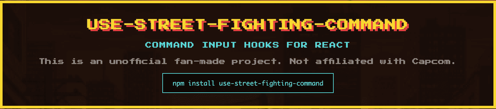

# use-street-fighting-command



> **Disclaimer**: This is an unofficial fan-made project and is not affiliated with, endorsed by, or connected to Capcom or the Street Fighter franchise in any way. "Street Fighter" is a registered trademark of Capcom Co., Ltd.

React custom hooks for detecting Street Fighter-style command inputs.

## Installation

```bash
npm install use-street-fighting-command
```

Or using other package managers:

```bash
pnpm add use-street-fighting-command
yarn add use-street-fighting-command
```

## Commands

### Motion Commands

| Command | Input | Notation |
|---------|-------|----------|
| Hadouken | ↓↘→+P | 236P |
| Shoryuken | →↓↘+P | 623P |
| Tatsumaki | ↓↙←+K | 214K |

### Charge Commands

| Command | Input | Notation |
|---------|-------|----------|
| Sonic Boom | ←charge→+P | [4]6P |
| Spinning Bird Kick | ↓charge↑+K | [2]8K |

### Super Commands

| Command | Input | Notation |
|---------|-------|----------|
| Shinku Hadouken | ↓↘→↓↘→+P | 236236P |

### Button Sequence Commands

| Command | Input | Notation |
|---------|-------|----------|
| Shun Goku Satsu | P P →+K P | LP LP → LK HP |

## Usage

### useStreetFightingCommand (Recommended)

A unified hook that detects multiple commands. Only commands with provided callbacks are activated.

```tsx
import { useStreetFightingCommand } from "use-street-fighting-command";

function App() {
  useStreetFightingCommand({
    onHadouken: () => console.log("Hadouken!"),
    onShoryuken: () => console.log("Shoryuken!"),
    onTatsumaki: () => console.log("Tatsumaki!"),
    onSonicBoom: () => console.log("Sonic Boom!"),
    onSpinningBirdKick: () => console.log("Spinning Bird Kick!"),
    onShinkuHadouken: () => console.log("Shinku Hadouken!"),
    onShunGokuSatsu: () => console.log("Shun Goku Satsu!"),
  });

  return <div>Press commands!</div>;
}
```

Enable only specific commands:

```tsx
// Only Hadouken is detected
useStreetFightingCommand({
  onHadouken: () => console.log("Hadouken!"),
});
```

### Individual Hooks

You can also use individual hooks for each command:

```tsx
import {
  useHadoken,
  useShoryuken,
  useTatsumaki,
  useSonicBoom,
  useSpinningBirdKick,
  useShinkuHadouken,
  useShunGokuSatsu,
} from "use-street-fighting-command";

function App() {
  // Motion commands
  useHadoken({ onCommand: () => console.log("Hadouken!") });
  useShoryuken({ onCommand: () => console.log("Shoryuken!") });
  useTatsumaki({ onCommand: () => console.log("Tatsumaki!") });

  // Charge commands
  useSonicBoom({ onCommand: () => console.log("Sonic Boom!") });
  useSpinningBirdKick({ onCommand: () => console.log("Spinning Bird Kick!") });

  // Super commands
  useShinkuHadouken({ onCommand: () => console.log("Shinku Hadouken!") });

  // Button sequence commands
  useShunGokuSatsu({ onCommand: () => console.log("Shun Goku Satsu!") });

  return <div>Press commands!</div>;
}
```

## Controls

### Directional Input
- Arrow keys: `↑` `↓` `←` `→`
- WASD: `W` `A` `S` `D`

### Buttons
- Punch: `P`
- Kick: `K`

## Options

### useStreetFightingCommand

| Option | Type | Default | Description |
|--------|------|---------|-------------|
| `onHadouken` | `() => void` | - | Callback for Hadouken (↓↘→+P) |
| `onShoryuken` | `() => void` | - | Callback for Shoryuken (→↓↘+P) |
| `onTatsumaki` | `() => void` | - | Callback for Tatsumaki (↓↙←+K) |
| `onSonicBoom` | `() => void` | - | Callback for Sonic Boom (←charge→+P) |
| `onSpinningBirdKick` | `() => void` | - | Callback for Spinning Bird Kick (↓charge↑+K) |
| `onShinkuHadouken` | `() => void` | - | Callback for Shinku Hadouken (↓↘→↓↘→+P) |
| `onShunGokuSatsu` | `() => void` | - | Callback for Shun Goku Satsu (P P →+K P) |
| `side` | `"1P"` \| `"2P"` | `"1P"` | Player side (affects forward direction) |
| `inputWindow` | `number` | `500` | Time window in ms to complete motion command (800ms for Shinku Hadouken, 1000ms for Shun Goku Satsu) |
| `chargeTime` | `number` | `800` | Time in ms to hold charge direction |

### Motion Command Hooks (useHadoken, useShoryuken, useTatsumaki)

| Option | Type | Default | Description |
|--------|------|---------|-------------|
| `onCommand` | `() => void` | required | Callback when command is detected |
| `side` | `"1P"` \| `"2P"` | `"1P"` | Player side (affects forward direction) |
| `inputWindow` | `number` | `500` | Time window in ms to complete command |

### Charge Command Hooks (useSonicBoom, useSpinningBirdKick)

| Option | Type | Default | Description |
|--------|------|---------|-------------|
| `onCommand` | `() => void` | required | Callback when command is detected |
| `side` | `"1P"` \| `"2P"` | `"1P"` | Player side (affects forward direction) |
| `chargeTime` | `number` | `800` | Time in ms to hold charge direction |
| `inputWindow` | `number` | `500` | Time window in ms after charge to input release |

### Super Command Hook (useShinkuHadouken)

| Option | Type | Default | Description |
|--------|------|---------|-------------|
| `onCommand` | `() => void` | required | Callback when command is detected |
| `side` | `"1P"` \| `"2P"` | `"1P"` | Player side (affects forward direction) |
| `inputWindow` | `number` | `800` | Time window in ms to complete command |

### Button Sequence Hook (useShunGokuSatsu)

| Option | Type | Default | Description |
|--------|------|---------|-------------|
| `onCommand` | `() => void` | required | Callback when command is detected |
| `side` | `"1P"` \| `"2P"` | `"1P"` | Player side (affects forward direction) |
| `inputWindow` | `number` | `1000` | Time window in ms to complete sequence |

### Side Configuration

- **1P**: Right is forward (commands entered as shown above)
- **2P**: Left is forward (commands are mirrored)

```tsx
// 2P side - command becomes ↓↙←+P
useHadoken({
  side: "2P",
  onCommand: () => console.log("Hadouken!"),
});
```

### Custom Input Window

```tsx
// Stricter timing (300ms)
useHadoken({
  onCommand: handleHadouken,
  inputWindow: 300,
});
```

## License

MIT
